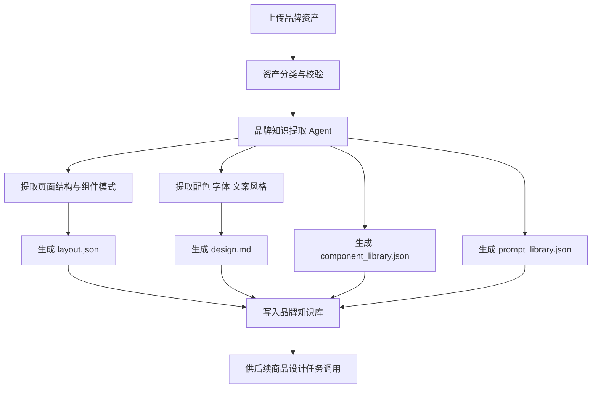
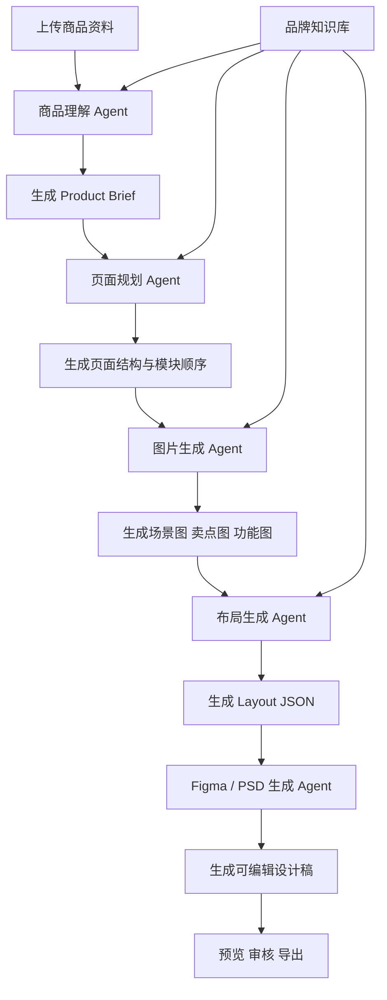
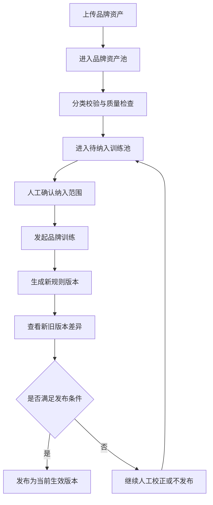
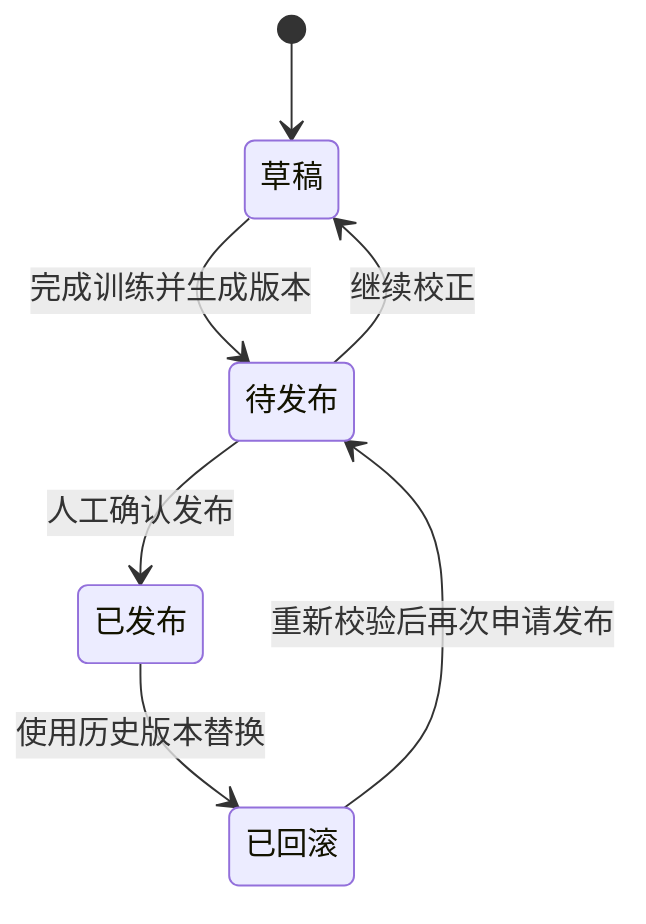
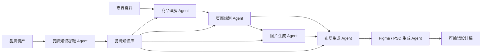

# BrandOS AI 电商设计平台 PRD

## 1. 文档信息

- 文档版本：V1.1
- 文档类型：产品需求文档（PRD）
- 产品名称：BrandOS AI 电商设计平台
- 当前阶段：MVP 规划

## 2. 项目背景

电商品牌在进行详情页、首页、活动页和素材设计时，通常面临以下问题：

- 设计资产分散在多个系统和文件格式中，难以统一沉淀。
- 不同设计师、运营和外包团队对品牌规范理解不一致，导致风格波动。
- 单个商品页面的设计周期长，反复沟通成本高。
- 新品上新、活动节点密集时，设计产能无法跟上业务节奏。

本项目希望通过 AI 对品牌历史资产进行持续学习，建立品牌专属设计知识库与设计规则体系，并基于商品素材自动生成符合品牌规范的电商页面与设计稿，最终形成品牌专属的设计 Agent。

## 3. 项目目标

### 3.1 产品目标

打造一个基于品牌知识库的 AI 电商设计平台，实现从品牌学习到商品页面设计输出的端到端闭环。

平台需要支持 AI 自动生成以下内容：

- 商品详情页
- 品牌首页
- 活动专题页
- Banner
- A+ 页面
- Figma 设计稿或 PSD

### 3.2 业务目标

- 降低电商视觉设计的人力投入与沟通成本。
- 提升品牌内容生产的一致性和复用率。
- 缩短新品和活动页面的设计交付周期。
- 形成可持续迭代的品牌设计资产和规则体系。

### 3.3 成功标准

- 品牌资产上传后，系统可自动提炼品牌设计规则并沉淀到知识库。
- 商品资料上传后，系统可在限定时间内生成结构完整的详情页设计稿。
- 生成结果在布局、配色、字体和文案风格上与品牌规范保持一致。
- 运营或设计人员可基于生成结果继续编辑与导出。

## 4. 目标用户

### 4.1 核心用户

- 品牌电商运营：希望快速产出详情页和活动页，提升上新效率。
- 品牌设计师：希望减少重复性排版工作，聚焦创意与审核。
- 设计主管或品牌负责人：希望统一品牌表达，降低协作偏差。

### 4.2 相关角色

- 品牌管理员：负责品牌创建、成员管理、资产管理和权限配置。
- AI 训练运营：负责上传品牌资料、维护知识库和校验规则提取质量。

## 5. 产品范围

### 5.1 本期解决的问题

- 统一管理品牌设计资产。
- 基于品牌资产自动建立 Brand Design System。
- 基于商品资料自动生成商品详情页设计方案。
- 输出可继续编辑的 Figma 设计稿或 PSD。

### 5.2 本期不解决的问题

- 全自动替代设计师完成复杂创意设计。
- 所有类型页面的一次性全覆盖。
- 多品牌复杂协同审批流。
- 视频、3D、动效等高复杂度内容生成。

## 6. 核心概念定义

### 6.1 Brand Design System

品牌设计系统是平台从品牌历史资产中抽取出的结构化设计知识集合，主要包括：

- 视觉规范：配色、字体、留白、栅格、装饰风格。
- 页面结构：常见模块、版式规律、信息层级。
- 组件库：标题区、卖点区、参数区、对比区、CTA 等组件模板。
- 文案风格：语气、句式、卖点组织方式、品牌调性。
- 生成提示词：用于不同页面和场景生成的 prompt 模板。

### 6.2 品牌知识库

品牌知识库是品牌资产、提取规则、结构化结果和历史生成记录的统一存储中心，是 AI 设计生成的核心基础设施。

### 6.3 设计任务

设计任务是以品牌和商品为上下文的一次生成请求，贯穿商品理解、页面规划、图片生成、布局生成和设计稿输出全过程。

## 7. 业务流程

### 7.1 品牌训练流程

品牌方或运营人员上传品牌相关资产，包括但不限于：

- 官网截图
- 官网 HTML
- 商品详情页
- 活动页
- 品牌设计规范
- 字体规范
- 配色规范
- PSD 设计稿
- 其他历史案例素材

系统对资产进行自动分析，提取以下信息：

- 页面布局规律
- 组件结构模式
- 配色体系
- 字体体系
- 文案风格
- 品牌调性

系统生成并沉淀以下结构化结果：

- `design.md`：品牌设计规则说明文档
- `layout.json`：页面布局规则与模板
- `component_library.json`：品牌组件库定义
- `prompt_library.json`：不同任务的提示词模板

以上结果统一存入品牌知识库，作为后续生成任务的基础输入。

#### 流程图

### 7.2 商品设计流程

用户上传商品相关资料：

- 商品主图
- 商品场景图
- 商品参数
- 商品卖点
- 商品 Brief

系统自动执行以下流程：

1. 商品理解：解析商品定位、卖点、受众和设计方向。
2. 页面规划：输出详情页模块结构与信息顺序。
3. 图片生成：按场景要求补充卖点图、氛围图和功能图。
4. 版式设计：根据品牌规则完成页面布局。
5. Figma 设计稿或 PSD 生成：输出可继续编辑的设计稿。
6. 结果导出：支持预览及导出对应结果。

#### 流程图

## 8. 功能需求

### 8.1 品牌管理模块

#### 功能说明

提供品牌的基础管理能力，承载品牌级知识与配置。

#### 主要功能

- 创建品牌
- 编辑品牌信息
- 品牌切换
- 品牌成员管理
- 品牌知识库入口管理

#### 产出价值

- 建立品牌级隔离空间
- 支持不同品牌的资产与规则独立沉淀
- 为多品牌扩展打下基础

### 8.2 品牌资产管理模块

#### 功能说明

支持品牌资产的上传、分类、查看和维护，是品牌训练的输入入口。

#### 支持文件类型

- 图片
- PSD
- PDF
- HTML
- Markdown
- Word

#### 资产分类

- 官网
- 详情页
- 活动页
- 品牌规范
- 字体
- 色卡
- 案例库

#### 基础能力

- 上传与存储
- 分类归档
- 版本更新
- 删除与停用
- 训练前校验

#### 资产纳入与规则发布机制

- 品牌资产需支持区分为核心规范、高质量案例、普通参考和排除样本。
- 不同类型资产对品牌规则学习的影响权重应可配置。
- 新上传资产默认进入待纳入训练池，不直接覆盖当前生效规则。
- 品牌管理员或设计负责人可决定哪些资产进入正式训练范围。
- 每次训练应生成新的规则版本，由人工确认后再发布为当前生效版本。

#### 训练发布流程

1. 上传品牌资产：资产进入品牌资产池，并完成分类与校验。
2. 进入待纳入训练池：由品牌管理员或设计负责人确认纳入范围。
3. 发起品牌训练：系统基于选定资产生成新的规则版本。
4. 查看版本差异：对比新旧版本在配色、字体、模块结构和文案风格上的变化。
5. 人工确认发布：确认后将新版本设为当前生效版本；如偏离较大则不发布或继续校正。

#### 流程图

### 8.3 规则版本管理模块

#### 功能说明

用于查看、对比、发布和回滚品牌规则版本，保证品牌知识库持续迭代但不发生不可控漂移。

#### 主要功能

- 查看规则版本列表
- 查看版本状态，包括草稿、待发布、已发布、已回滚
- 对比两个版本的关键差异
- 为版本补充说明与变更原因
- 发布指定版本为当前生效版本
- 回滚到历史稳定版本

#### 关键对比维度

- 配色体系变化
- 字体体系变化
- 模块结构变化
- 组件库变化
- Prompt 模板变化
- 文案风格变化

#### 产出价值

- 避免持续上传资产导致规则无感漂移
- 支持品牌规则演进过程可追溯、可解释
- 为设计负责人提供可控发布机制

#### 版本状态流转图

### 8.4 品牌知识提取 Agent

#### 输入

- 品牌资产

#### 输出

- `design.md`
- `layout.json`
- `component_library.json`
- `prompt_library.json`

#### 核心职责

- 分析页面结构
- 分析配色规则
- 分析字体规则
- 分析文案风格
- 提取设计规则
- 识别品牌共性模板

#### 成功标准

- 可输出结构化规则文件
- 可被后续 Agent 直接消费
- 结果支持人工校正与重新训练
- 结果可与历史版本进行差异对比，识别是否出现规则漂移

### 8.5 商品理解 Agent

#### 输入

- 商品资料
- 品牌知识库中的品牌规则

#### 输出

- `Product Brief`

#### `Product Brief` 包含内容

- 商品定位
- 目标用户
- 核心卖点
- 竞争优势
- 设计方向
- 页面表达重点

#### 核心价值

将原始商品信息转化为后续页面规划和视觉生成可直接使用的结构化输入。

### 8.6 页面规划 Agent

#### 输入

- `Product Brief`
- `Brand Design System`

#### 输出

- 页面结构定义
- 模块顺序
- 各模块目标说明

#### 示例模块

- Hero
- Feature
- Scenario
- Technology
- Parameter
- Brand Story
- CTA

#### 核心职责

- 决定页面信息架构
- 组织卖点节奏与信息层级
- 控制内容完整度和阅读体验

### 8.7 图片生成 Agent

#### 输入

- 商品图
- 场景要求
- 品牌规则

#### 输出

- 场景图
- 卖点图
- 氛围图
- 功能图

#### 核心职责

- 生成符合品牌风格的视觉素材
- 弥补商品素材不足的问题
- 为后续布局生成提供可用图像资源

### 8.8 布局生成 Agent

#### 输入

- 页面结构
- 品牌规则
- 生成图片素材

#### 输出

- 页面布局 JSON

#### 核心职责

- 将模块结构转化为可渲染的版式结果
- 控制栅格、间距、对齐和层级关系
- 保证生成布局可映射到 Figma 或 PSD

### 8.9 Figma / PSD 生成 Agent

#### 输入

- `Layout JSON`

#### 输出

- Figma 页面或 PSD 设计稿

#### 支持能力

- 文本图层生成
- 图片图层生成
- 组件图层生成
- 自动排版
- 结构化命名

#### 核心价值

输出可继续编辑的 Figma 页面或 PSD 设计稿，而不是静态图片，方便设计师二次创作与审核。

#### Agent 协作流程图

## 9. 非功能需求

### 9.1 性能要求

- 品牌资产训练任务应支持异步执行。
- 单个商品详情页生成任务在 MVP 阶段目标为 5 分钟内完成。
- 任务执行过程应支持状态展示，包括排队中、处理中、生成成功、生成失败。

### 9.2 可维护性要求

- 品牌规则文件应支持版本管理。
- 生成链路需保留中间产物，便于追踪和复盘。
- 各 Agent 输出需采用结构化格式，便于替换模型和调优流程。

### 9.3 规则稳定性要求

- 系统应控制品牌规则随持续上传资产而发生明显漂移。
- 训练过程应优先参考品牌规范、官方模板和高质量案例，避免低质量或临时性素材污染主规则。
- 详情页、活动页、首页等不同页面类型的规则应支持分场景沉淀，避免互相干扰。
- 规则版本发布前应支持关键差异对比，包括配色、字体、模块结构和文案风格。
- 当新版本规则偏离过大时，应支持不发布、回滚或继续人工校正。

### 9.4 可扩展性要求

- 支持未来扩展到首页、活动页、Banner、A+ 页面。
- 支持引入更多图片模型、语言模型和设计执行引擎。
- 支持未来增加人工反馈闭环和强化学习能力。

## 10. MVP 范围

### 10.1 MVP 包含

- 品牌知识库建设
- 品牌规则学习与结构化沉淀
- 商品详情页生成
- Figma 设计稿或 PSD 生成
- 结果预览与基础编辑能力（是否纳入 MVP 视开发情况待定）

### 10.2 MVP 不包含

- PSD 导出
- 视频生成
- 多品牌复杂协同
- 基于人工反馈的强化学习
- 首页、活动页、Banner、A+ 页面全量开放

## 11. 验收标准

### 11.1 品牌训练验收

- 上传品牌资料后，系统可自动生成 `design.md`。
- 系统可输出可被后续流程消费的结构化规则文件。
- 品牌规则结果可查看、可管理、可更新版本。

### 11.2 商品生成验收

- 上传商品资料后，系统可自动生成商品详情页方案。
- 在标准数据输入下，5 分钟内完成详情页生成。
- 生成结果支持预览、编辑和导出 Figma，并兼容 PSD 设计稿输出能力。
- 设计稿在风格、配色、字体和模块结构上符合品牌规范。

### 11.3 系统可用性验收

- 用户可查看设计任务执行状态。
- 失败任务可返回明确失败原因。
- 同一品牌下的历史任务和结果可追溯。

## 12. 后续迭代方向

- 支持更多页面类型的自动生成。
- 支持设计结果评分与人工反馈闭环。
- 支持组件级编辑与局部重生成。
- 支持多品牌团队协同与审批流。
- 支持更多设计工具和导出格式。
