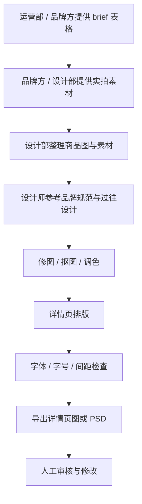
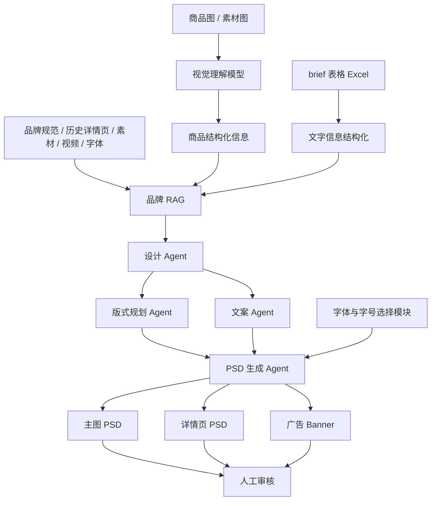
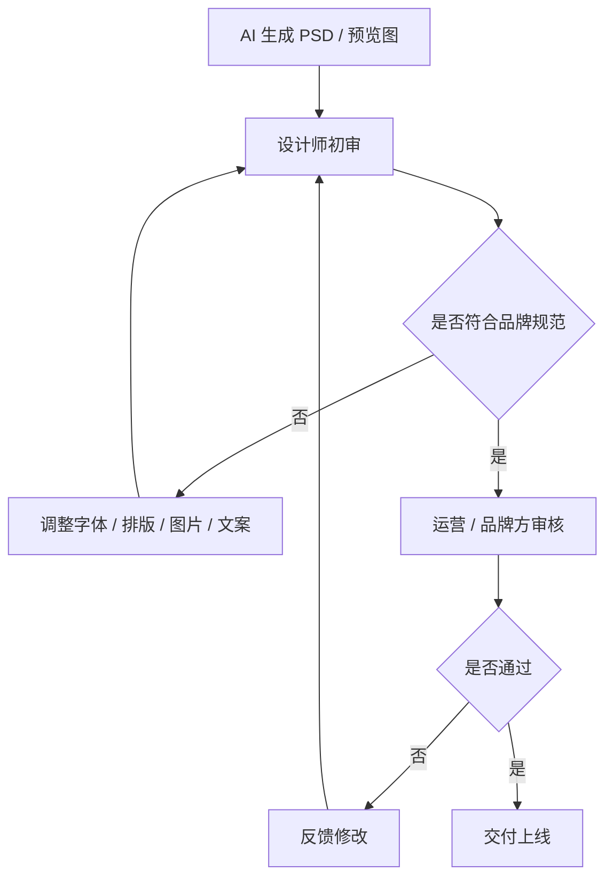

# 详情页自动生成工作流说明文档

## 1. 项目背景

目前详情页设计流程主要由运营部或品牌方提供 `brief` 表格，品牌方或设计部提供实拍素材图，再由设计部根据品牌视觉规范、过往设计风格和参考图，手动完成详情页设计。

本项目希望通过 AI 工作流，将商品图、品牌素材、历史详情页、品牌设计规范、字体规范等信息整合，自动生成接近品牌既有风格的详情页 PSD，从而减少设计师在修图、排版、详情页延展等重复性工作上的投入，让设计师有更多时间进行创意设计和质量把控。

---

## 2. 当前素材与参考信息

当前文件夹中包含以下内容：

```text
素材文件夹
├── 字体
├── 图包
├── 参考图.png
└── ANKORAU × ANAR FC 详情页.xlsx
```

### 2.1 素材说明

| 文件 / 文件夹 | 说明 |
|---|---|
| 字体 | 品牌或设计部提供的字体文件，用于详情页中文字排版 |
| 图包 | 商品实拍图、场景图、细节图等设计素材 |
| 参考图.png | 已生成或已设计完成的详情页参考图，本次目标效果需接近该图 |
| ANKORAU × ANAR FC 详情页.xlsx | 当前项目 brief 表格，包含详情页中需要使用的文字、卖点、参数等信息 |

### 2.2 参考图说明

参考图是一个电脑包详情页成品图，其排版方式参考 `ANKORAU × ANAR FC 详情页.xlsx` 中的详情页结构。

本次 AI 生成目标是：

- 生成效果接近参考图中的电脑包详情页风格；
- 保持品牌视觉一致性；
- 按照品牌对字体、字号、排版和视觉质量的要求生成；
- 输出可供设计师继续编辑的 PSD 文件。

---

## 3. 现有人工工作流程

当前人工流程大致如下：



### 3.1 当前流程特点

- brief 通常由运营部或品牌方提供；
- 商品图、细节图、场景图等素材由品牌方或设计部提供；
- 设计部根据品牌规范、历史素材和参考图完成设计；
- 详情页设计工作中存在大量重复性的修图、排版、美工处理；
- 字体、字号、行距、间距、品牌色等有严格限制；
- 甲方公司，尤其外资品牌，对设计质量和品牌一致性要求较高。

---

## 4. 目标 AI 工作流

目标是建立一套可结合商品图、brief、品牌素材库、历史设计图和品牌规范的自动化详情页生成流程。

整体流程如下：



---

## 5. 核心输入

### 5.1 商品图 / 素材图

来源包括：

- 品牌方提供的实拍图；
- 设计部拍摄或整理的商品图；
- 商品细节图；
- 场景图；
- 材质图；
- 使用场景视频或短片截图。

AI 需要识别：

- 商品类型；
- 商品外观；
- 商品结构；
- 颜色；
- 材质；
- 功能点；
- 可用于详情页展示的局部细节；
- 适合主视觉、细节模块、卖点模块的图片。

---

### 5.2 brief 表格

brief 一般由运营部或品牌方提供，通常为 Excel 格式。

例如：

```text
ANKORAU × ANAR FC 详情页.xlsx
```

表格中可能包含：

| 信息类型 | 示例 |
|---|---|
| 商品名称 | 电脑包 / 双肩包 / 配件包 |
| 品牌名称 | ANKORAU × ANAR FC |
| 核心卖点 | 防泼水、轻量、通勤、收纳分区 |
| 商品参数 | 尺寸、重量、材质、容量 |
| 使用场景 | 通勤、旅行、办公 |
| 文案要求 | 标题、副标题、卖点说明 |
| 详情页模块 | 主视觉、卖点介绍、细节展示、参数说明 |
| 禁用词 / 注意事项 | 平台限制、品牌语气限制 |

---

### 5.3 品牌 RAG

品牌 RAG 不只是文字知识库，而是一个多模态品牌知识库。

它可以包含：

| 类型 | 内容 |
|---|---|
| 品牌设计规范 | Logo 使用规范、品牌色、辅助色、字体规范、留白规则 |
| 历史详情页 | 过往设计完成的详情页、PSD、导出图 |
| 历史主图 | 电商主图、活动主图 |
| 广告 Banner | 活动图、推广图 |
| 素材图 | 商品图、模特图、场景图、细节图 |
| 视频素材 | 品牌视频、产品展示视频、广告短片 |
| 字体文件 | 品牌指定字体、可商用字体 |
| brief 表格 | 品牌提供的商品信息表 |
| 文案资产 | 品牌常用语气、标题风格、卖点表达方式 |

### 5.4 与现有 IT 系统的关系

公司已有 IT 部门开发的系统，其逻辑与本流程有一定相似性：

- 品牌方提供 Excel 数据表；
- 详情页中用到的信息以文字形式列好；
- 系统自动从表格中调取对应信息；
- 再填入页面或模板中。

本 AI 工作流在此基础上进一步扩展：

| 现有 IT 系统 | AI 工作流 |
|---|---|
| 主要读取 Excel 表格中的文字信息 | 读取 Excel、图片、PSD、视频、字体、品牌规范等多模态资料 |
| 更偏数据填充 | 更偏设计理解、风格提取和生成 |
| 依赖固定模板 | 可根据品牌历史设计自动规划版式 |
| 输出结构化页面内容 | 输出可编辑 PSD、详情页、Banner 等视觉资产 |

---

## 6. 核心模块说明

## 6.1 视觉理解模型

输入：

- 商品主图；
- 商品细节图；
- 场景图；
- 参考图；
- 历史详情页。

输出商品结构化信息，例如：

```json
{
  "product_type": "电脑包",
  "main_color": "黑色",
  "material": "尼龙 / 防泼水面料",
  "key_features": [
    "大容量",
    "多分区收纳",
    "防泼水",
    "轻量通勤"
  ],
  "usable_images": {
    "hero_image": "主视觉图",
    "detail_images": ["拉链细节", "内部分区", "背带细节"],
    "scene_images": ["办公桌场景", "通勤场景"]
  }
}
```

---

## 6.2 商品结构化信息模块

该模块负责将视觉模型识别出的内容，与 brief 表格中的文字信息进行合并。

目标是形成统一的商品信息结构：

```json
{
  "brand": "ANKORAU × ANAR FC",
  "product": "电脑包",
  "selling_points": [
    "轻量通勤",
    "多功能收纳",
    "简洁商务风格"
  ],
  "specifications": {
    "size": "根据 brief 提取",
    "weight": "根据 brief 提取",
    "material": "根据 brief 提取"
  },
  "design_reference": "参考图.png"
}
```

---

## 6.3 品牌 RAG

品牌 RAG 负责回答以下问题：

- 这个品牌常用什么版式？
- 标题通常放在哪里？
- 图片和文字比例是多少？
- 详情页模块顺序是什么？
- 字体用什么？
- 字号范围是多少？
- 主色和辅助色是什么？
- 品牌视觉偏简洁、科技、运动、户外还是商务？
- 历史详情页中常用哪些构图方式？
- 参考图中的排版规律是什么？

品牌 RAG 的核心目标是：

> 通过品牌设计规范和过往设计好的素材图，提取品牌视觉风格，并指导新详情页自动生成。

---

## 6.4 设计 Agent

设计 Agent 负责整体视觉策略判断。

主要任务：

- 分析品牌风格；
- 分析参考图的设计结构；
- 选择适合本商品的视觉方向；
- 判断图片使用方式；
- 决定整体色调、节奏和模块层级；
- 保证输出符合品牌调性。

输出示例：

```text
设计方向：
- 整体风格参考电脑包参考图；
- 使用深色背景与简洁文字结构；
- 强调商品质感和通勤属性；
- 页面节奏以大图展示 + 局部细节 + 功能说明为主；
- 保持 ANKORAU × ANAR FC 详情页排版逻辑。
```

---

## 6.5 版式规划 Agent

版式规划 Agent 负责将详情页拆分成具体模块。

例如：

| 模块 | 内容 | 视觉形式 |
|---|---|---|
| 01 主视觉 | 商品名称、主卖点、商品大图 | 大幅商品图 + 品牌标题 |
| 02 核心卖点 | 3-4 个主要卖点 | 图标 / 短文案 / 局部图 |
| 03 细节展示 | 拉链、面料、收纳结构 | 局部放大图 |
| 04 使用场景 | 通勤、办公、旅行 | 场景图 |
| 05 参数说明 | 尺寸、容量、材质 | 表格式或信息卡片 |
| 06 品牌收尾 | Logo、品牌语 | 极简品牌视觉 |

输出为页面结构规划，例如：

```json
{
  "page_type": "detail_page",
  "modules": [
    {
      "name": "hero",
      "height": 1200,
      "layout": "left_text_right_product",
      "elements": ["brand_logo", "main_title", "subtitle", "product_image"]
    },
    {
      "name": "selling_points",
      "height": 900,
      "layout": "three_column_cards",
      "elements": ["point_1", "point_2", "point_3"]
    }
  ]
}
```

---

## 6.6 文案 Agent

文案 Agent 负责根据 brief 和品牌语气生成或优化详情页文案。

要求：

- 不脱离 brief；
- 不夸大商品功能；
- 遵守平台规则；
- 保持品牌语气；
- 符合详情页阅读节奏；
- 标题短、清晰、有层级。

示例：

```text
主标题：
轻装通勤，高效收纳

副标题：
为日常办公与短途出行设计的多功能电脑包

卖点：
- 多分区结构，电脑与随身物品有序收纳
- 防泼水面料，应对日常天气变化
- 简洁外观，适配多种通勤场景
```

---

## 6.7 字体与字号选择模块

由于品牌对字体和字体大小有严格限制，生成前需要增加一个可选择配置项。

### 6.7.1 生成前配置项

用户在生成详情页前可选择：

| 配置项 | 示例 |
|---|---|
| 主标题字体 | 品牌指定字体 / 上传字体 |
| 副标题字体 | 品牌指定字体 / 系统字体 |
| 正文字体 | 品牌指定字体 / 可商用字体 |
| 主标题字号 | 48px / 56px / 64px |
| 副标题字号 | 24px / 28px / 32px |
| 正文字号 | 18px / 20px / 22px |
| 行距 | 1.2 / 1.4 / 1.6 |
| 字间距 | 默认 / 加宽 / 自定义 |
| 字重 | Regular / Medium / Bold |
| 文字颜色 | 品牌黑 / 品牌白 / 品牌灰 / 自定义 |
| 是否严格锁定字体规范 | 是 / 否 |

### 6.7.2 字体规范来源

字体与字号可以来自：

- 品牌设计规范；
- 历史详情页 PSD；
- 参考图识别；
- 用户手动选择；
- 系统默认规范。

### 6.7.3 推荐逻辑

系统可以提供两种模式：

#### 模式一：严格品牌规范模式

适用于外资品牌、品牌方审核严格的项目。

特点：

- 字体必须来自品牌字体库；
- 字号只能在品牌允许范围内选择；
- 行距、字距、颜色严格受控；
- 生成结果优先保证一致性。

#### 模式二：智能推荐模式

适用于探索阶段或设计师初稿阶段。

特点：

- 系统根据参考图和历史设计自动推荐字体组合；
- 用户可手动调整；
- 生成结果更灵活。

---

## 6.8 PSD 生成 Agent

PSD 生成 Agent 负责将设计方案转换为可编辑 PSD 文件。

输出要求：

- 所有文字保留为可编辑文字图层；
- 图片保留为独立图层；
- 背景、装饰元素、图标分层清晰；
- 图层命名规范；
- 分组结构清晰；
- 支持设计师二次修改。

### 6.8.1 PSD 图层结构示例

```text
详情页 PSD
├── 01_Hero_主视觉
│   ├── BG_背景
│   ├── IMG_商品主图
│   ├── TXT_主标题
│   ├── TXT_副标题
│   └── LOGO_品牌
├── 02_SellingPoints_核心卖点
│   ├── Card_卖点1
│   ├── Card_卖点2
│   └── Card_卖点3
├── 03_Details_细节展示
│   ├── IMG_拉链细节
│   ├── IMG_材质细节
│   └── TXT_说明文案
├── 04_Specs_参数说明
└── 05_Ending_品牌收尾
```

---

## 7. 输出内容

系统最终可输出：

| 输出类型 | 说明 |
|---|---|
| 主图 PSD | 电商主图，可用于商品列表或首图 |
| 详情页 PSD | 完整详情页，可编辑 |
| 广告 Banner | 可用于活动页、广告投放、站内推广 |
| 预览图 PNG / JPG | 用于快速审核 |
| 设计说明 JSON | 记录使用的字体、字号、颜色、模块结构等 |

---

## 8. 人工审核流程

AI 输出后必须进入人工审核。



### 8.1 审核重点

| 审核项 | 说明 |
|---|---|
| 品牌一致性 | 是否符合品牌视觉规范 |
| 字体字号 | 是否使用指定字体和允许字号 |
| 图片质量 | 抠图、清晰度、色彩是否达标 |
| 版式质量 | 是否接近参考图风格，是否美观 |
| 文案准确性 | 是否与 brief 一致，是否有夸大 |
| 商品信息准确性 | 尺寸、材质、功能是否正确 |
| PSD 可编辑性 | 图层是否清晰，文字是否可编辑 |

---

## 9. 关键价值

### 9.1 对设计部

- 减少重复性修图和排版工作；
- 快速生成详情页初稿；
- 设计师可以把更多时间用于创意、审美和质量把控；
- 提升多 SKU 批量设计效率。

### 9.2 对运营部

- 更快完成商品上线素材准备；
- brief 信息可以被系统自动调取；
- 降低沟通成本；
- 提升详情页制作效率。

### 9.3 对品牌方 / 甲方

- 保持品牌视觉统一；
- 降低因人工执行差异导致的质量波动；
- 提高项目交付效率；
- 尤其适合对质量要求较高的外资品牌。

---

## 10. 推荐落地版本

### 10.1 第一阶段：半自动生成

目标是辅助设计师生成详情页初稿。

功能包括：

- 读取 brief Excel；
- 识别商品图；
- 引用参考图风格；
- 选择字体和字号；
- 自动生成详情页预览图；
- 输出 PSD；
- 人工审核修改。

### 10.2 第二阶段：品牌 RAG 增强

目标是让系统更好理解品牌风格。

功能包括：

- 接入历史详情页；
- 接入品牌规范；
- 接入字体库；
- 提取历史版式规律；
- 根据品牌风格自动推荐版式。

### 10.3 第三阶段：多场景批量生成

目标是批量生成主图、详情页和广告 Banner。

功能包括：

- 多 SKU 批量生成；
- 自动适配不同尺寸；
- 自动生成主图、详情页、Banner；
- 自动检查品牌规范；
- 输出审核报告。

---

## 11. 总结

该工作流的核心不是简单地把 Excel 内容填入模板，而是通过商品视觉理解、品牌 RAG、历史设计风格提取、字体规范控制和 PSD 自动生成，实现一个面向品牌详情页设计的智能生产流程。

核心能力包括：

1. 从商品图中理解商品结构和卖点；
2. 从 brief 表格中提取详情页文字信息；
3. 从品牌规范和历史素材中提取品牌风格；
4. 根据参考图生成相似排版效果；
5. 支持字体和字号选择；
6. 输出可编辑 PSD；
7. 通过人工审核保证最终质量。

最终目标是：

> 在保证品牌质量和视觉一致性的前提下，减少设计师重复性工作，提高详情页、主图和广告 Banner 的生产效率。